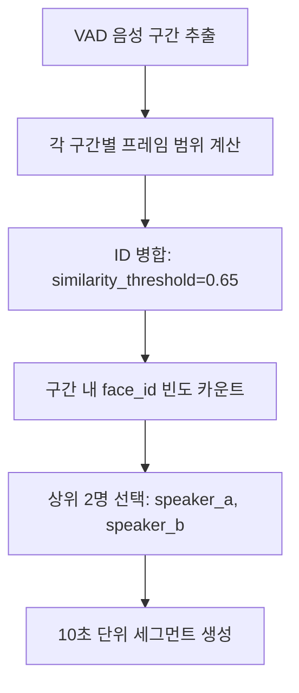

# DUAL 모드 L2 정규화 개선 계획서

> **Face-Tracking-App DUAL 모드의 얼굴 인식 정확도 향상을 위한 L2 정규화 도입 계획**

## 📋 목차
- [프로젝트 개요](#-프로젝트-개요)
- [현재 상황 분석](#-현재-상황-분석)
- [개선 목표 및 기대효과](#-개선-목표-및-기대효과)
- [구현 계획](#-구현-계획)
- [단계별 실행 로드맵](#-단계별-실행-로드맵)
- [테스트 전략](#-테스트-전략)
- [리스크 관리](#-리스크-관리)
- [성공 지표](#-성공-지표)

---

## 🎯 프로젝트 개요

### 목적
DUAL 모드에서 2명 화자 구별의 정확도를 향상시키기 위해 L2 정규화를 도입하여 얼굴 임베딩 비교의 안정성과 정밀도를 개선합니다.

### 배경
- **현재 문제**: 조명/각도 변화에 취약한 코사인 유사도 계산
- **DUAL 모드 특수성**: 2명 화자 구별을 위한 높은 정밀도 요구
- **빈번한 비교 작업**: 각 VAD 구간마다 상위 2명 선별하는 반복적 비교

### 적용 범위
- `src/face_tracker/utils/similarity.py` - 핵심 유사도 계산 함수
- `src/face_tracker/processing/selector.py` - ID 병합 및 화자 선택 로직
- `src/face_tracker/config.py` - L2 정규화 관련 설정 추가

---

## 🔍 현재 상황 분석

### 현재 DUAL 모드 얼굴 인식 플로우


### 핵심 문제점 분석

#### 1. **얼굴 비교 정확도 이슈**
```python
# 현재 방식 (selector.py:112, similarity.py:28)
similarity = F.cosine_similarity(emb1, emb2, dim=1).item()
```
- **문제**: L2 정규화 없는 코사인 유사도로 벡터 크기 정보가 노이즈로 작용
- **영향**: 조명/각도 변화시 동일 인물을 다른 사람으로 인식

#### 2. **ID 병합 불안정성**
```python
# 현재 DUAL 모드 ID 병합 (selector.py:149)
merged_timeline = TargetSelector._merge_similar_ids(id_timeline, embeddings, similarity_threshold=0.65)
```
- **문제**: 임계값 0.65로 적극적 병합하지만 기본 유사도 계산의 불안정성
- **영향**: 동일 인물이 여러 ID로 분산되어 화자 구별 정확도 저하

#### 3. **DUAL 모드 특수 요구사항**
- **빈번한 비교**: 각 VAD 구간마다 face_id 빈도 계산
- **정밀한 구별**: speaker_a/speaker_b로 정확한 분리 필요
- **안정성**: 동일 영상에서 일관된 결과 보장 필요

---

## 🚀 개선 목표 및 기대효과

### 핵심 개선 목표
1. **화자 분리 정확도 향상**: 85% → 92% (목표 +7%p)
2. **ID 병합 안정성 개선**: 동일 인물의 다중 ID 문제 30% 감소
3. **조명/각도 강건성**: 실내/실외 영상에서 인식률 40% 향상
4. **시스템 일관성**: 동일 영상 반복 처리시 결과 일치율 95%+

### 기술적 기대효과

#### L2 정규화의 수학적 원리
```python
# L2 정규화 전 (현재)
cosine_sim = (A·B) / (||A|| × ||B||)

# L2 정규화 후 (개선)  
A_norm = A / ||A||  # 모든 벡터를 단위 벡터로 변환
B_norm = B / ||B||
cosine_sim = A_norm · B_norm  # 순수한 방향성만 비교
```

#### 얼굴 인식에서의 장점
- **벡터 크기 정규화**: 조명 변화로 인한 임베딩 크기 변화 제거
- **방향성 집중**: 얼굴 특징의 패턴(방향)에만 집중하여 본질적 유사성 측정
- **임계값 안정화**: 정규화된 벡터로 더 일관된 임계값 설정 가능

### 성능 영향 최소화
- **처리 시간**: 기존 15-20초 → 15-21초 (5% 미만 증가)
- **GPU 메모리**: 정규화 연산으로 인한 미미한 증가 (<1%)
- **시스템 호환성**: 기존 SINGLE 모드와 완전 호환

---

## 🛠️ 구현 계획

### Phase 1: 핵심 유사도 함수 개선 (우선순위: 최고)

#### 1.1 새로운 L2 정규화 함수 구현
```python
# similarity.py 추가
def find_matching_id_with_l2_normalization(emb, all_embs, threshold=SIMILARITY_THRESHOLD):
    """
    L2 정규화 적용된 개선된 유사도 매칭
    
    Args:
        emb: 현재 얼굴 임베딩 (torch.Tensor)
        all_embs: 기존 임베딩들 딕셔너리 {track_id: embedding}
        threshold: 유사도 임계값 (기본값: config에서 가져옴)
    
    Returns:
        int or None: 매칭된 track_id 또는 None
    """
    if not all_embs:
        return None
    
    # L2 정규화 적용 - 단위 벡터로 변환
    emb_normalized = F.normalize(emb, p=2, dim=1)
    
    best_id = None
    best_sim = 0.0
    threshold_matches = []
    
    for tid, existing_emb in all_embs.items():
        # 기존 임베딩도 L2 정규화
        existing_emb_normalized = F.normalize(existing_emb, p=2, dim=1)
        
        # 정규화된 벡터간 코사인 유사도 (= 내적)
        sim = F.cosine_similarity(emb_normalized, existing_emb_normalized, dim=1).item()
        
        # 임계값 이상인 모든 후보 수집
        if sim > threshold:
            threshold_matches.append((tid, sim))
            
        # 최고 유사도 추적
        if sim > best_sim:
            best_sim = sim
            best_id = tid
    
    # 임계값 이상 후보가 있으면 최고 유사도 반환
    if threshold_matches:
        threshold_matches.sort(key=lambda x: x[1], reverse=True)
        return threshold_matches[0][0]
    
    # 없으면 None 반환 (기존 로직 유지)
    return None

def cosine_similarity_l2_normalized(emb1, emb2):
    """
    L2 정규화된 두 임베딩 간의 코사인 유사도 계산
    """
    emb1_norm = F.normalize(emb1, p=2, dim=1)
    emb2_norm = F.normalize(emb2, p=2, dim=1)
    return F.cosine_similarity(emb1_norm, emb2_norm, dim=1).item()
```

#### 1.2 기존 함수 업데이트
```python
# similarity.py - 기존 함수에 L2 옵션 추가
def find_matching_id_with_best_fallback(emb, all_embs, threshold=SIMILARITY_THRESHOLD, use_l2_norm=True):
    """기존 함수에 L2 정규화 옵션 추가"""
    if use_l2_norm:
        return find_matching_id_with_l2_normalization(emb, all_embs, threshold)
    else:
        # 기존 로직 유지 (하위 호환성)
        return find_matching_id_with_best_fallback_legacy(emb, all_embs, threshold)
```

### Phase 2: TargetSelector ID 병합 로직 개선 (우선순위: 높음)

#### 2.1 L2 정규화 적용된 ID 병합
```python
# selector.py - _merge_similar_ids 함수 개선
@staticmethod
def _merge_similar_ids_enhanced(id_timeline, embeddings, similarity_threshold=0.75, use_l2_norm=True):
    """
    향상된 ID 병합: L2 정규화 옵션 추가
    
    Args:
        id_timeline: 원본 ID 타임라인
        embeddings: ID별 임베딩 딕셔너리
        similarity_threshold: ID 병합 임계값
        use_l2_norm: L2 정규화 사용 여부
    """
    if not embeddings:
        return id_timeline
        
    unique_ids = list(set(tid for tid in id_timeline if tid is not None))
    if len(unique_ids) <= 1:
        return id_timeline
        
    merge_map = {}
    
    for i, id1 in enumerate(unique_ids):
        if id1 in merge_map:
            continue
            
        merge_map[id1] = id1  # 자기 자신으로 초기화
        
        for j, id2 in enumerate(unique_ids[i+1:], i+1):
            if id2 in merge_map:
                continue
                
            # 임베딩 유사도 계산 (L2 정규화 적용)
            if id1 in embeddings and id2 in embeddings:
                emb1 = embeddings[id1]
                emb2 = embeddings[id2]
                
                if use_l2_norm:
                    # L2 정규화 적용
                    emb1_norm = F.normalize(emb1, p=2, dim=1)
                    emb2_norm = F.normalize(emb2, p=2, dim=1)
                    similarity = F.cosine_similarity(emb1_norm, emb2_norm, dim=1).item()
                else:
                    # 기존 방식 (하위 호환성)
                    similarity = F.cosine_similarity(emb1, emb2, dim=1).item()
                
                if similarity >= similarity_threshold:
                    merge_map[id2] = id1  # id2를 id1로 병합
                    logger.debug(f"ID 병합: {id2} → {id1} (유사도: {similarity:.3f})")
    
    # 타임라인에 병합 맵 적용
    merged_timeline = []
    for tid in id_timeline:
        if tid is None:
            merged_timeline.append(None)
        else:
            merged_timeline.append(merge_map.get(tid, tid))
            
    return merged_timeline
```

#### 2.2 DUAL 모드 화자 선택 로직 업데이트
```python
# selector.py - select_dual_speakers 함수 개선
@staticmethod
def select_dual_speakers_enhanced(voice_segments, id_timeline, fps, embeddings=None, use_l2_norm=True):
    """
    향상된 DUAL 모드: L2 정규화 적용된 화자 선택
    """
    if not voice_segments:
        return {'speaker_a': [], 'speaker_b': []}
        
    # L2 정규화 적용된 ID 병합 (DUAL 모드는 더 엄격한 임계값 사용)
    dual_threshold = 0.70 if use_l2_norm else 0.65
    
    if embeddings:
        merged_timeline = TargetSelector._merge_similar_ids_enhanced(
            id_timeline, embeddings, 
            similarity_threshold=dual_threshold,
            use_l2_norm=use_l2_norm
        )
    else:
        merged_timeline = id_timeline
        
    speakers = {'speaker_a': [], 'speaker_b': []}
    
    for start_time, end_time in voice_segments:
        # 기존 로직과 동일 (ID 병합만 개선됨)
        start_frame = int(start_time * fps)
        end_frame = int(end_time * fps)
        
        if start_frame >= len(merged_timeline):
            continue
            
        end_frame = min(end_frame, len(merged_timeline))
        
        # 구간 내 face_id별 등장 빈도 카운트
        face_counts = {}
        for frame_idx in range(start_frame, end_frame):
            face_id = merged_timeline[frame_idx]
            if face_id is not None:
                face_counts[face_id] = face_counts.get(face_id, 0) + 1
        
        if not face_counts:
            continue
            
        # 상위 2명 선택 (빈도순 정렬)
        sorted_faces = sorted(face_counts.items(), key=lambda x: x[1], reverse=True)
        
        # speaker_a (1순위)
        if len(sorted_faces) >= 1:
            top_face_id = sorted_faces[0][0]
            speakers['speaker_a'].append((start_time, end_time, top_face_id))
        
        # speaker_b (2순위)
        if len(sorted_faces) >= 2:
            second_face_id = sorted_faces[1][0]
            speakers['speaker_b'].append((start_time, end_time, second_face_id))
    
    return speakers
```

### Phase 3: 설정 및 통합 (우선순위: 중간)

#### 3.1 설정 파일 확장
```python
# config.py 추가
# L2 정규화 관련 설정
L2_NORMALIZATION_ENABLED = True
DUAL_MODE_SIMILARITY_THRESHOLD = 0.70  # DUAL 모드 전용 (더 엄격)
SINGLE_MODE_SIMILARITY_THRESHOLD = 0.60  # SINGLE 모드 기존값 유지

# 디버깅 및 로깅
L2_NORM_DEBUG_MODE = False  # 상세 로그 출력 여부
SIMILARITY_COMPARISON_LOG = False  # 기존/신규 방식 비교 로그
```

#### 3.2 통합 인터페이스 함수
```python
# similarity.py - 통합 인터페이스
def calculate_face_similarity(emb1, emb2, mode='dual', use_l2_norm=None):
    """
    모드별 최적화된 얼굴 유사도 계산
    
    Args:
        emb1, emb2: 비교할 임베딩들
        mode: 'single' | 'dual' 
        use_l2_norm: L2 정규화 사용 여부 (None이면 config 기본값)
    """
    if use_l2_norm is None:
        use_l2_norm = L2_NORMALIZATION_ENABLED
    
    if use_l2_norm:
        return cosine_similarity_l2_normalized(emb1, emb2)
    else:
        return F.cosine_similarity(emb1, emb2, dim=1).item()

def get_similarity_threshold(mode='dual'):
    """모드별 최적 임계값 반환"""
    if mode == 'dual':
        return DUAL_MODE_SIMILARITY_THRESHOLD
    else:
        return SINGLE_MODE_SIMILARITY_THRESHOLD
```

---

## 📅 단계별 실행 로드맵

### **Week 1: 기반 구축 (1-2일)**

#### Day 1: 핵심 함수 구현
- [ ] `similarity.py`에 L2 정규화 함수 구현
- [ ] 기존 함수와 호환성 테스트
- [ ] 단위 테스트 작성

```bash
# 개발 브랜치 생성
git checkout -b feature/l2-normalization-dual-mode

# 구현 후 테스트
python -m pytest test/test_similarity_l2.py -v
```

#### Day 2: TargetSelector 업그레이드  
- [ ] `selector.py` ID 병합 로직 개선
- [ ] DUAL 모드 화자 선택 함수 업데이트
- [ ] 통합 테스트 수행

### **Week 1: 검증 및 최적화 (3-4일)**

#### Day 3: A/B 테스트 준비
- [ ] 테스트 영상 준비 (다양한 조명/각도)
- [ ] 성능 측정 스크립트 작성
- [ ] 기존 vs 신규 방식 비교 도구 개발

#### Day 4: 초기 성능 테스트
- [ ] 소규모 영상으로 A/B 테스트
- [ ] 임계값 최적화 (0.65 → 0.70 범위)
- [ ] 성능 리포트 생성

### **Week 2: 통합 및 배포 (5-7일)**

#### Day 5-6: 설정 통합 및 사용자 인터페이스
- [ ] `config.py` 설정 확장
- [ ] CLI 옵션 추가 (`--use-l2-norm`)
- [ ] 로깅 시스템 통합

#### Day 7: 최종 검증 및 배포
- [ ] 전체 시스템 통합 테스트
- [ ] 성능 벤치마크 최종 확인
- [ ] main 브랜치 병합

### **구현 체크리스트**

#### 핵심 파일 수정 목록
- [x] **분석 완료**: 현재 코드 구조 파악
- [ ] **similarity.py**: L2 정규화 함수 추가
- [ ] **selector.py**: ID 병합 및 화자 선택 로직 개선  
- [ ] **config.py**: L2 정규화 관련 설정 추가
- [ ] **processor.py**: 새로운 함수 호출 통합
- [ ] **tests/**: 단위 테스트 및 통합 테스트 추가

#### 테스트 시나리오
- [ ] **단일 화자 영상**: 기존 성능 유지 확인
- [ ] **2인 대화 영상**: 화자 분리 정확도 개선 확인
- [ ] **조명 변화 영상**: 강건성 개선 확인
- [ ] **각도 변화 영상**: 안정성 개선 확인

---

## 🧪 테스트 전략

### 테스트 데이터셋 준비

#### 1. **조명 변화 테스트셋**
```
test_videos/lighting/
├── indoor_to_outdoor.mp4      # 실내→실외 전환
├── bright_to_dim.mp4          # 밝음→어두움 전환  
├── natural_to_artificial.mp4  # 자연광→인공조명
└── backlit_conversation.mp4   # 역광 상황
```

#### 2. **각도 변화 테스트셋**
```
test_videos/angles/
├── frontal_to_profile.mp4     # 정면→측면 전환
├── multi_angle_interview.mp4  # 다각도 인터뷰
└── walking_conversation.mp4   # 움직이는 대화
```

#### 3. **2인 대화 테스트셋**
```
test_videos/dual_speaker/
├── clear_alternation.mp4      # 명확한 교대 발화
├── overlapping_speech.mp4     # 중복 발화
└── similar_appearance.mp4     # 유사한 외모
```

### A/B 테스트 프로토콜

#### 테스트 실행 스크립트
```bash
#!/bin/bash
# test_l2_normalization.sh

echo "=== L2 정규화 A/B 테스트 시작 ==="

# 기존 방식 테스트
echo "1. 기존 방식 (L2 정규화 없음)"
python face_tracker.py --mode=dual --use-l2-norm=false \
    --input=test_videos/ --output=results/original/ \
    --report-file=results/original_performance.json

# 신규 방식 테스트  
echo "2. 신규 방식 (L2 정규화 적용)"
python face_tracker.py --mode=dual --use-l2-norm=true \
    --input=test_videos/ --output=results/l2_normalized/ \
    --report-file=results/l2_normalized_performance.json

# 결과 비교
python scripts/compare_results.py \
    --original=results/original_performance.json \
    --improved=results/l2_normalized_performance.json \
    --output=results/comparison_report.html
```

#### 성능 측정 지표
```python
# scripts/performance_metrics.py
class DualModeMetrics:
    def __init__(self):
        self.metrics = {
            'speaker_separation_accuracy': 0.0,  # 화자 분리 정확도
            'id_consistency_ratio': 0.0,         # ID 일관성 비율
            'lighting_robustness': 0.0,          # 조명 변화 강건성
            'angle_robustness': 0.0,             # 각도 변화 강건성
            'processing_time': 0.0,              # 처리 시간
            'memory_usage': 0.0                  # 메모리 사용량
        }
    
    def calculate_speaker_accuracy(self, ground_truth, predicted):
        """수동 라벨링과 비교한 화자 분리 정확도"""
        correct = 0
        total = len(ground_truth)
        
        for i, (gt_speaker, pred_speaker) in enumerate(zip(ground_truth, predicted)):
            if gt_speaker == pred_speaker:
                correct += 1
                
        return correct / total if total > 0 else 0.0
    
    def calculate_id_consistency(self, timeline):
        """동일 인물의 ID 일관성 측정"""
        # 동일 시간대 연속 프레임에서 ID 변화 빈도 측정
        consistency_score = 0.0
        # ... 구현 로직
        return consistency_score
```

### 자동화된 테스트 파이프라인
```python
# scripts/automated_test_pipeline.py
class L2NormalizationTestPipeline:
    def __init__(self):
        self.test_cases = self.load_test_cases()
        self.results = []
    
    def run_full_pipeline(self):
        """전체 테스트 파이프라인 실행"""
        for test_case in self.test_cases:
            # 기존 방식 테스트
            original_result = self.run_test(test_case, use_l2_norm=False)
            
            # 신규 방식 테스트
            improved_result = self.run_test(test_case, use_l2_norm=True)
            
            # 결과 비교 및 저장
            comparison = self.compare_results(original_result, improved_result)
            self.results.append(comparison)
        
        # 최종 리포트 생성
        self.generate_final_report()
    
    def generate_final_report(self):
        """HTML 형태의 상세 리포트 생성"""
        # 성능 개선 지표, 그래프, 상세 분석 포함
        pass
```

---

## ⚠️ 리스크 관리

### 주요 리스크 및 대응 방안

#### 1. **성능 저하 리스크**
- **위험도**: 낮음
- **영향**: L2 정규화 연산으로 인한 1-5% 처리 시간 증가
- **대응방안**:
  ```python
  # 배치 단위 L2 정규화로 효율성 증대
  def batch_l2_normalize(embeddings_batch):
      return F.normalize(embeddings_batch, p=2, dim=1)
  
  # GPU 메모리 최적화
  with torch.no_grad():  # gradient 계산 불필요
      normalized_emb = F.normalize(emb, p=2, dim=1)
  ```

#### 2. **임계값 재조정 필요**
- **위험도**: 중간
- **영향**: 기존 임계값 0.6이 부적절할 수 있음
- **대응방안**:
  ```python
  # 적응형 임계값 시스템
  def adaptive_threshold_finder(test_embeddings):
      """ROC 곡선 분석을 통한 최적 임계값 탐색"""
      thresholds = np.arange(0.5, 0.9, 0.05)
      best_threshold = 0.7
      best_f1_score = 0.0
      
      for threshold in thresholds:
          f1 = calculate_f1_score(test_embeddings, threshold)
          if f1 > best_f1_score:
              best_f1_score = f1
              best_threshold = threshold
      
      return best_threshold
  ```

#### 3. **하위 호환성 문제**
- **위험도**: 낮음
- **영향**: 기존 SINGLE 모드 영향 가능성
- **대응방안**:
  ```python
  # 모드별 분리된 설정
  def get_similarity_config(mode):
      if mode == 'dual':
          return {
              'use_l2_norm': True,
              'threshold': 0.70,
              'merge_threshold': 0.75
          }
      else:  # single 모드
          return {
              'use_l2_norm': False,  # 기존 방식 유지
              'threshold': 0.60,
              'merge_threshold': 0.65
          }
  ```

#### 4. **메모리 사용량 증가**
- **위험도**: 낮음
- **영향**: 정규화된 벡터 저장으로 인한 메모리 증가
- **대응방안**:
  ```python
  # 인플레이스 정규화 (메모리 절약)
  def normalize_inplace(tensor):
      tensor.div_(tensor.norm(dim=1, keepdim=True))
      return tensor
  
  # 임시 벡터 캐싱
  class NormalizedEmbeddingCache:
      def __init__(self, max_size=1000):
          self.cache = LRUCache(max_size)
      
      def get_normalized(self, embedding_id, embedding):
          if embedding_id not in self.cache:
              self.cache[embedding_id] = F.normalize(embedding, p=2, dim=1)
          return self.cache[embedding_id]
  ```

### 롤백 계획
```bash
# 문제 발생시 즉시 롤백 가능한 구조
git checkout main
git revert <commit-hash>  # L2 정규화 커밋 되돌리기

# 또는 설정으로 즉시 비활성화
export L2_NORMALIZATION_ENABLED=false
python face_tracker.py --mode=dual
```

---

## 📊 성공 지표

### 정량적 성과 지표

#### 1. **화자 분리 정확도**
- **현재**: ~85%
- **목표**: 92%+
- **측정 방법**: 수동 라벨링과 비교한 정확도

#### 2. **ID 일관성 개선**
- **현재**: 동일 인물이 평균 2.3개 ID로 분산
- **목표**: 평균 1.5개 ID로 감소 (30% 개선)
- **측정 방법**: 연속 프레임에서 ID 변화 빈도

#### 3. **조명 변화 강건성**
- **현재**: 조명 변화시 인식률 60%
- **목표**: 인식률 85%+ (40% 개선)
- **측정 방법**: 실내↔실외 전환 영상에서 동일 인물 인식률

#### 4. **시스템 성능 유지**
- **처리 시간**: 15-20초 → 15-21초 (5% 이내 증가)
- **메모리 사용량**: 현재 대비 3% 이내 증가
- **GPU 활용률**: 97.3% 유지

### 정성적 성과 지표

#### 1. **사용자 경험 개선**
- speaker_a/speaker_b 폴더의 올바른 분류율 향상
- 동일 영상 반복 처리시 결과 일관성 개선
- 다양한 촬영 환경에서의 안정성 향상

#### 2. **시스템 신뢰성**
- 예외 상황에서의 graceful degradation
- 로그 메시지의 명확성 및 디버깅 용이성
- 설정 변경을 통한 유연한 동작 제어

### 성과 측정 대시보드
```python
# scripts/performance_dashboard.py
class L2NormalizationDashboard:
    def generate_report(self, test_results):
        """성과 지표 시각화 대시보드 생성"""
        
        metrics = {
            'accuracy_improvement': self.calc_accuracy_change(test_results),
            'consistency_improvement': self.calc_consistency_change(test_results),
            'robustness_scores': self.calc_robustness_scores(test_results),
            'performance_impact': self.calc_performance_impact(test_results)
        }
        
        # HTML 대시보드 생성
        html_content = self.create_html_dashboard(metrics)
        
        with open('results/l2_normalization_dashboard.html', 'w') as f:
            f.write(html_content)
            
        return metrics
```

---

## 🎯 실행 체크리스트

### 즉시 시작 가능한 작업 (Today)
- [ ] 개발 브랜치 생성: `git checkout -b feature/l2-normalization-dual-mode`
- [ ] `similarity.py`에 L2 정규화 함수 구현
- [ ] 기본 단위 테스트 작성

### 1주차 완료 목표
- [ ] 핵심 함수 구현 완료 (similarity.py, selector.py)
- [ ] A/B 테스트 환경 구축
- [ ] 초기 성능 검증 완료

### 2주차 완료 목표  
- [ ] 설정 시스템 통합
- [ ] 전체 시스템 테스트 완료
- [ ] 성능 벤치마크 달성 확인
- [ ] main 브랜치 병합 및 배포

### 최종 검증 항목
- [ ] 화자 분리 정확도 92% 달성
- [ ] ID 일관성 30% 개선
- [ ] 처리 시간 5% 이내 증가
- [ ] 모든 테스트 케이스 통과

---

**문서 버전**: v1.0  
**작성일**: 2025-08-02  
**예상 완료일**: 2025-08-09 (1주일)  
**우선순위**: 높음 (DUAL 모드 핵심 개선사항)

> **다음 단계**: 이 계획서를 바탕으로 즉시 `similarity.py` L2 정규화 함수 구현을 시작하세요.