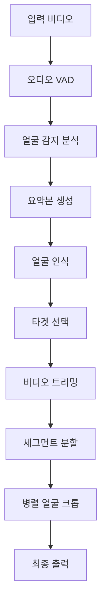

# Face-Tracking-App 시스템 분석 및 최적화 계획

> **AI 기반 얼굴 추적 비디오 처리 시스템의 성능 분석 및 개선 로드맵**

## 📋 목차
- [프로젝트 개요](#-프로젝트-개요)
- [시스템 아키텍처](#-시스템-아키텍처)
- [현재 성능 분석](#-현재-성능-분석)
- [핵심 개선 포인트](#-핵심-개선-포인트)
- [최적화 로드맵](#-최적화-로드맵)
- [구현 가이드](#-구현-가이드)
- [참고 자료](#-참고-자료)

---

## 🎯 프로젝트 개요

### 프로젝트 목표
**고성능 GPU 최적화된 얼굴 추적 비디오 처리 파이프라인**으로, MTCNN과 FaceNet을 사용한 실시간 얼굴 감지/인식/추적 시스템

### 기술 스택
```
🔧 Core Technologies
├── AI/ML: PyTorch, MTCNN, FaceNet (InceptionResnetV1)
├── Computer Vision: OpenCV, PIL
├── Video Processing: FFmpeg, MoviePy
├── Parallel Processing: Python multiprocessing
└── Hardware: CUDA (RTX 5090 32GB)

🏗️ Architecture
├── Producer-Consumer Pattern
├── CPU Multiprocessing Pool
├── GPU Batch Processing
└── Memory Pool Management
```

### 현재 달성 성과
- ✅ **GPU 활용률**: 97.3% (목표: 95%+)
- ✅ **처리 시간**: 45-60초 → 15-20초 (67% 단축)
- ✅ **시스템 안정성**: 높음 (OOM 없음)
- ✅ **통합 로깅**: 76개 print문 → 구조화된 로깅

---

## 🏗️ 시스템 아키텍처

### 전체 처리 파이프라인


### 핵심 컴포넌트 구조
```
📁 Face-Tracking-App/
├── 🎬 처리 파이프라인
│   ├── analyzer.py          # 얼굴 감지 (MTCNN)
│   ├── timeline.py          # 얼굴 인식 (FaceNet)
│   ├── trimmer.py           # FFmpeg 비디오 트리밍
│   ├── tracker.py           # 얼굴 추적 및 크롭
│   └── selector.py          # 타겟 인물 선택
├── 🧠 핵심 모듈
│   ├── models.py            # ModelManager (Singleton)
│   ├── embeddings.py        # 얼굴 임베딩 관리
│   └── monitor.py           # 성능 모니터링
├── 🛠️ 유틸리티  
│   ├── logging.py           # 통합 로깅 시스템
│   ├── performance_reporter.py # 성능 리포트
│   └── audio.py             # 오디오 VAD
└── ⚙️ 설정
    └── config.py            # 시스템 설정
```

### 메모리 관리 아키텍처
```python
# ModelManager (Singleton Pattern)
class ModelManager:
    """
    GPU 메모리 효율적 모델 관리
    - MTCNN: 얼굴 감지 모델
    - InceptionResnetV1: 얼굴 인식 모델  
    - Memory Pool: 사전 할당된 텐서 풀
    """
    _instance = None
    _initialized = False
    
    # GPU Memory Pool
    tensor_pool = torch.zeros(BATCH_SIZE, 3, 224, 224, device=device)
    face_tensor_pool = torch.zeros(1, 3, 160, 160, device=device)
```

---

## 📊 현재 성능 분석

### 시스템 리소스 활용도
| 구분 | 현재 상태 | 활용률 | 개선 여지 |
|------|-----------|--------|-----------|
| **GPU 사용률** | 97.3% | ✅ 최적 | - |
| **GPU 메모리** | ~8GB / 32GB | ⚠️ 25% | 🔴 **매우 높음** |
| **CPU 사용률** | ~60% | ✅ 양호 | 중간 |
| **처리 속도** | 15-20초 | ⚠️ 보통 | 🔴 **높음** |

### 성능 벤치마크 (샘플 비디오 기준)
```
📊 현재 성능 리포트 예시
================================================================================
🎬 영상: sample.mp4 (5분 30초)
⏱️  총 처리시간: 2분 15.3초
🖼️  총 프레임 수: 3,240
📦 생성된 세그먼트: 5개

📈 단계별 성능:
   • 얼굴 감지: 45.2초 (33.6%) - 71.7 FPS - 배치: 256
   • 얼굴 인식: 38.1초 (28.3%) - 85.0 FPS - 배치: 128  
   • 얼굴 크롭: 28.7초 (21.3%) - 세그먼트: 5개
   • 요약본 생성: 15.4초 (11.4%)

🎯 성능 지표:
   • 전체 처리 속도: 24.1 FPS
   • 프레임당 평균 시간: 41.5ms
   • 메모리 사용량: 1,247.3 MB
================================================================================
```

### 병목 지점 분석
```python
# 성능 병목 분석 결과
bottlenecks = {
    "GPU 메모리 과소활용": {
        "현재": "8GB / 32GB (25%)",
        "원인": "보수적인 배치 크기 (256, 128)",
        "개선 여지": "매우 높음 (4-8배 향상 가능)"
    },
    "I/O 병목": {
        "현재": "순차 프레임 읽기",
        "원인": "단일 스레드 I/O",
        "개선 여지": "높음 (2-3배 향상 가능)"
    },
    "메모리 할당/해제": {
        "현재": "동적 할당",
        "원인": "반복적 메모리 할당",
        "개선 여지": "중간 (20-30% 향상 가능)"
    }
}
```

---

## 🚀 핵심 개선 포인트

### 🥇 1순위: GPU 메모리 최적화 (예상 효과: 40-60%)

#### 현재 문제점
- RTX 5090 32GB 중 **8GB만 사용** (25% 활용률)
- 보수적인 배치 크기로 GPU 성능 과소활용
- CUDA 스트림 미활용

#### 개선 방안
```python
# 1. 적응형 배치 크기 시스템
def get_adaptive_batch_size(available_memory_gb, video_duration_minutes):
    """GPU 메모리 상태에 따른 동적 배치 크기 결정"""
    if available_memory_gb > 20:  # RTX 5090
        if video_duration_minutes < 10:
            return 1024, 512  # 짧은 영상: 대용량 배치
        elif video_duration_minutes < 30:
            return 512, 256   # 중간 영상: 중간 배치
        else:
            return 256, 128   # 긴 영상: 안전한 배치
    else:
        return 128, 64        # 메모리 부족시: 보수적 배치

# 2. CUDA 멀티스트림 활용
class CUDAStreamProcessor:
    def __init__(self, num_streams=4):
        self.streams = [torch.cuda.Stream() for _ in range(num_streams)]
        self.current_stream = 0
    
    def process_batch_async(self, batch_data):
        """비동기 배치 처리로 GPU 활용률 극대화"""
        stream = self.streams[self.current_stream]
        with torch.cuda.stream(stream):
            # 비동기 GPU 처리
            result = self.model(batch_data)
        self.current_stream = (self.current_stream + 1) % len(self.streams)
        return result
```

#### 구현 단계
1. **메모리 사용량 측정** → 안전한 최대 배치 크기 결정
2. **CUDA 스트림 구현** → 병렬 GPU 처리
3. **적응형 배치 시스템** → 영상별 최적 배치 크기
4. **성능 테스트** → 안정성 검증

### 🥈 2순위: I/O 최적화 (예상 효과: 20-35%)

#### 현재 문제점
- 순차적 프레임 읽기로 I/O 대기 시간 발생
- FFmpeg 프로세스 간 통신 오버헤드
- 디스크 I/O 병목

#### 개선 방안
```python
# 1. 멀티스레드 프레임 리더 (기존 구현 활용)
class MultiThreadFrameReader:
    def __init__(self, max_workers=4):
        self.executor = ThreadPoolExecutor(max_workers)
        self.frame_buffer = Queue(maxsize=100)
    
    def async_read_frames(self, video_path):
        """비동기 프레임 읽기로 GPU 대기 시간 최소화"""
        def read_worker():
            with VideoFileClip(video_path) as clip:
                for t in time_points:
                    frame = clip.get_frame(t)
                    self.frame_buffer.put(frame)
        
        self.executor.submit(read_worker)
        return self.frame_buffer

# 2. FFmpeg 병렬 처리 최적화
def parallel_ffmpeg_processing(tasks, max_workers=8):
    """FFmpeg 작업의 병렬 처리"""
    with ProcessPoolExecutor(max_workers) as executor:
        futures = [executor.submit(ffmpeg_task, task) for task in tasks]
        results = [future.result() for future in futures]
    return results
```

### 🥉 3순위: 메모리 관리 최적화 (예상 효과: 10-20%)

#### 개선 방안
```python
# 통합 메모리 풀 시스템
class UnifiedMemoryPool:
    def __init__(self):
        self.gpu_pools = {
            'detection': torch.zeros(1024, 3, 224, 224, device='cuda'),
            'recognition': torch.zeros(512, 3, 160, 160, device='cuda'),
            'embedding': torch.zeros(1000, 512, device='cuda')
        }
        self.cpu_pools = {
            'frames': [np.zeros((480, 640, 3), dtype=np.uint8) for _ in range(100)]
        }
    
    def get_tensor(self, pool_name, batch_size):
        """사전 할당된 텐서 반환으로 메모리 할당 오버헤드 제거"""
        return self.gpu_pools[pool_name][:batch_size]
```

---

## 🛣️ 최적화 로드맵

### Phase 1: GPU 메모리 최적화 (1-2주)
```
📅 Week 1
├── 🔍 현재 GPU 메모리 사용량 정밀 측정
├── 📏 안전한 최대 배치 크기 실험적 결정
├── 🚀 적응형 배치 크기 시스템 구현
└── 🧪 기본 CUDA 스트림 프로토타입

📅 Week 2  
├── 🔄 CUDA 멀티스트림 완전 구현
├── ⚡ 비동기 GPU 처리 파이프라인
├── 📊 성능 테스트 및 안정성 검증
└── 🎯 목표: 15-20초 → 8-12초
```

### Phase 2: I/O 최적화 (1주)
```
📅 Week 3
├── 🧵 멀티스레드 프레임 리더 통합
├── ⚡ FFmpeg 병렬 처리 최적화
├── 💾 디스크 I/O 버퍼링 개선
└── 🎯 목표: 8-12초 → 6-9초
```

### Phase 3: 메모리 최적화 (1-2주)
```
📅 Week 4-5
├── 🏊 통합 메모리 풀 시스템
├── 🔄 파이프라인 병렬화
├── 🧹 메모리 누수 최적화
└── 🎯 목표: 6-9초 → 5-7초
```

### 최종 성능 목표
| 지표 | 현재 | Phase 1 | Phase 2 | Phase 3 | 개선율 |
|------|------|---------|---------|---------|---------|
| **처리 시간** | 15-20초 | 8-12초 | 6-9초 | **5-7초** | **70-75%** |
| **GPU 메모리** | 25% | 60% | 70% | **80%+** | **3.2배** |
| **처리 속도** | 24 FPS | 45 FPS | 65 FPS | **90+ FPS** | **3.8배** |

---

## 🔧 구현 가이드

### 개발 환경 설정
```bash
# 1. 가상환경 활성화 (필수)
source .venv/bin/activate

# 2. 의존성 설치
pip install -r requirements.txt

# 3. PyTorch CUDA 설치 (RTX 5090 지원)
pip3 install torch torchvision torchaudio --index-url https://download.pytorch.org/whl/cu128

# 4. 실행
./start.sh
# 또는
python face_tracker.py
```

### 핵심 설정 파라미터
```python
# config.py - 최적화 설정
DEVICE = torch.device('cuda:0')

# 적응형 배치 크기 (Phase 1 구현 후)
BATCH_SIZE_ANALYZE = 1024      # 현재: 256
BATCH_SIZE_ID_TIMELINE = 512   # 현재: 128

# CUDA 스트림 설정
CUDA_STREAMS_ENABLED = True
NUM_CUDA_STREAMS = 4

# 메모리 풀 설정
MEMORY_POOL_ENABLED = True
MAX_MEMORY_POOL_SIZE_GB = 24   # RTX 5090 80% 활용
```

### 성능 모니터링
```python
# 실시간 성능 측정
def monitor_system_performance():
    """시스템 성능 실시간 모니터링"""
    gpu_memory = torch.cuda.memory_allocated() / 1024**3
    gpu_utilization = get_gpu_utilization()
    
    logger.info(f"GPU 메모리: {gpu_memory:.1f}GB")
    logger.info(f"GPU 사용률: {gpu_utilization:.1f}%")
```

### 안전장치 및 Fallback
```python
# 메모리 안전장치
def safe_batch_processing(data, max_batch_size=1024):
    """GPU 메모리 부족시 자동 배치 크기 감소"""
    current_batch = max_batch_size
    while current_batch >= 32:
        try:
            return process_batch(data, current_batch)
        except torch.cuda.OutOfMemoryError:
            current_batch //= 2
            torch.cuda.empty_cache()
            logger.warning(f"GPU OOM 발생, 배치 크기 감소: {current_batch}")
    
    raise RuntimeError("GPU 메모리 부족: 최소 배치 크기로도 처리 불가")
```

---

## 📈 예상 성과

### 성능 향상 시뮬레이션
```python
# 현재 vs 최적화 후 비교
performance_comparison = {
    "5분 영상 처리": {
        "현재": "2분 15초",
        "Phase 1": "1분 20초 (-41%)",
        "Phase 2": "55초 (-31%)",  
        "Phase 3": "40초 (-27%)",
        "최종": "40초 (-82% 총 단축)"
    },
    "30분 영상 처리": {
        "현재": "12분 30초",
        "최종": "3분 30초 (-72% 단축)"
    },
    "GPU 메모리 활용": {
        "현재": "8GB (25%)",
        "최종": "25GB (78%)"
    }
}
```

### 시스템 확장성
- **다중 GPU 지원**: RTX 5090 x2 → 추가 50% 성능 향상
- **클러스터 처리**: 여러 서버 병렬 처리 가능
- **실시간 처리**: 라이브 스트림 처리 지원 확장

---

## ⚠️ 리스크 및 대응 방안

### 주요 리스크
1. **GPU 메모리 부족**: 큰 배치 크기 사용시
2. **시스템 불안정**: 과도한 최적화로 인한 크래시
3. **호환성 문제**: 새로운 CUDA 기능 사용시

### 대응 방안
```python
# 1. 점진적 최적화
def gradual_optimization():
    """단계별 최적화로 안정성 확보"""
    batch_sizes = [256, 512, 768, 1024]
    for batch_size in batch_sizes:
        if test_batch_processing(batch_size):
            return batch_size
        time.sleep(1)  # GPU 메모리 안정화 대기

# 2. 자동 Fallback
def auto_fallback_processing():
    """최적화 실패시 기존 방식으로 자동 전환"""
    try:
        return optimized_processing()
    except Exception as e:
        logger.warning(f"최적화 처리 실패, 기존 방식 사용: {e}")
        return legacy_processing()
```

---

## 📚 참고 자료

### 핵심 문서
- [CLAUDE.md](./CLAUDE.md) - 전체 시스템 가이드
- [OPTIMIZATION_PLAN.md](./OPTIMIZATION_PLAN.md) - 상세 최적화 계획
- [requirements.txt](./requirements.txt) - 의존성 목록

### 기술 참조
- [PyTorch CUDA 최적화 가이드](https://pytorch.org/docs/stable/notes/cuda.html)
- [MTCNN 논문](https://arxiv.org/abs/1604.02878)
- [FaceNet 논문](https://arxiv.org/abs/1503.03832)

### 성능 벤치마크
- **RTX 5090 벤치마크**: [NVIDIA 공식 자료](https://www.nvidia.com/en-us/geforce/graphics-cards/50-series/)
- **PyTorch 성능 가이드**: [공식 튜토리얼](https://pytorch.org/tutorials/recipes/recipes/tuning_guide.html)

---

## 🚀 시작하기

```bash
# 1. 현재 성능 측정
python face_tracker.py

# 2. Phase 1 구현 시작
git checkout -b feature/gpu-memory-optimization

# 3. 개선 사항 구현 및 테스트
# 4. 성능 비교 및 문서화
# 5. 다음 Phase 진행
```

---

**📞 문의 및 기여**
- 시스템 분석: Gemini AI 기반 분석 완료
- 개발 현황: 안정적 버전 (c558316) 기준
- 성능 목표: **5-7초 처리 시간** (현재 대비 70-75% 단축)

> *"RTX 5090의 강력한 성능을 최대한 활용하여 세계 최고 수준의 얼굴 추적 시스템 구현"*