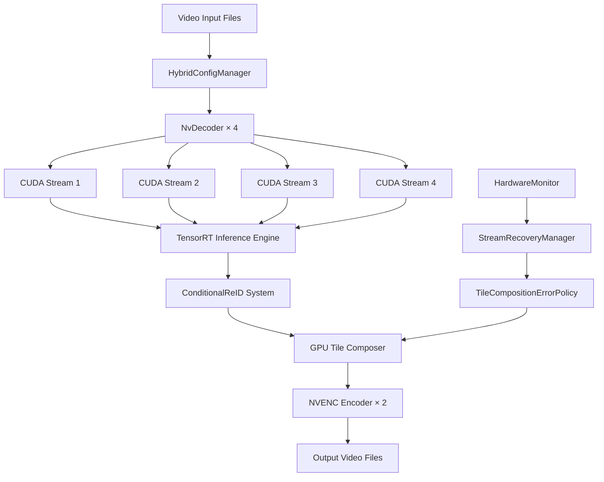

# Dual-Face GPU 파이프라인 기술 아키텍처 가이드

## 🏗️ 시스템 아키텍처 개요

### **핵심 설계 철학**

**제로카피 Full GPU 파이프라인**: CPU↔GPU 메모리 복사 완전 제거
**모듈러 설계**: 각 컴포넌트 독립적 개발/테스트/교체 가능
**장애 탄력성**: 단일 실패점 제거 및 자동 복구 시스템

### **전체 아키텍처 다이어그램**



---

## 🔧 핵심 컴포넌트 아키텍처

### 1. **HybridConfigManager** (설정 관리 계층)

```python
class HybridConfigManager:
    """
    3단계 우선순위 설정 시스템:
    1순위: manual_config.yaml (사용자 수동 설정)
    2순위: auto_detected.yaml (하드웨어 프로빙 결과)  
    3순위: fallback_config.yaml (안전한 기본값)
    """
    
    def __init__(self):
        self.config_hierarchy = {
            'manual': ManualConfigLoader(),
            'probing': HardwareProber(), 
            'fallback': FallbackConfigLoader()
        }
        self.current_config = None
        self.validation_rules = ConfigValidationRules()
        
    def load_optimal_config(self) -> Dict[str, Any]:
        """최적 설정 로드 (우선순위 기반)"""
        for config_type in ['manual', 'probing', 'fallback']:
            try:
                config = self.config_hierarchy[config_type].load()
                if self.validation_rules.validate(config):
                    self.current_config = config
                    logger.info(f"✅ {config_type} 설정 적용 성공")
                    return config
            except ConfigurationError as e:
                logger.warning(f"⚠️ {config_type} 설정 실패: {e}")
                continue
        
        raise CriticalConfigurationError("모든 설정 옵션 실패")
        
    def get_stream_allocation(self) -> StreamAllocationConfig:
        """스트림별 리소스 할당"""
        return StreamAllocationConfig(
            nvdec_sessions=self.current_config['nvdec']['max_sessions'],
            nvenc_sessions=self.current_config['nvenc']['max_sessions'],
            cuda_streams=self.current_config['cuda']['stream_count'],
            vram_per_stream=self.current_config['memory']['vram_per_stream_mb']
        )
```

**설정 파일 구조**:

```yaml
# manual_config.yaml (사용자 우선 설정)
hardware:
  gpu_id: 0
  nvdec_engines: 4      # RTX 5090 확정값
  nvenc_engines: 2      # RTX 5090 확정값
  
processing:
  batch_size_decode: 8
  batch_size_inference: 16
  cuda_streams: 4
  
memory:
  vram_limit_gb: 24     # 32GB 중 75% 사용
  vram_per_stream_mb: 6144  # 6GB per stream
  
models:
  face_detection: "yolo_face_fp16.trt"
  reid_model: "reid_lightweight_128d.trt"
```

### 2. **NvDecoder** (디코딩 계층)

```python
class NvDecoder:
    """
    PyNvCodec 기반 하드웨어 디코더
    완전 GPU 메모리 기반 처리 (제로카피)
    """
    
    def __init__(self, video_path: str, gpu_id: int = 0):
        self.video_path = video_path
        self.gpu_id = gpu_id
        
        # PyNvCodec 초기화
        self.decoder = nvc.PyDecodeHW(
            video_path, 
            nvc.PixelFormat.NV12, 
            gpu_id
        )
        
        # 색공간 변환기 (NV12 → RGB)
        self.converter = nvc.PySurfaceConverter(
            self.decoder.Width(),
            self.decoder.Height(),
            nvc.PixelFormat.NV12,
            nvc.PixelFormat.RGB,
            gpu_id
        )
        
        # GPU 메모리 풀
        self.surface_pool = SurfacePool(
            width=self.decoder.Width(),
            height=self.decoder.Height(),
            pool_size=16  # 충분한 버퍼링
        )
        
    def decode_batch(self, batch_size: int) -> List[torch.Tensor]:
        """배치 단위 디코딩 (GPU 메모리 직접 처리)"""
        batch_frames = []
        
        for _ in range(batch_size):
            # NVDEC 디코딩 (GPU 메모리)
            nv12_surface = self.decoder.DecodeSurface()
            if not nv12_surface:
                break
                
            # 색공간 변환 (GPU 메모리 내)
            rgb_surface = self.converter.Execute(nv12_surface)
            
            # DLPack을 통한 제로카피 텐서 변환
            tensor = dlpack.fromDLPack(rgb_surface.GetDLPackTensor())
            batch_frames.append(tensor)
            
        return batch_frames
        
    def get_video_info(self) -> VideoInfo:
        """비디오 메타데이터"""
        return VideoInfo(
            width=self.decoder.Width(),
            height=self.decoder.Height(), 
            fps=self.decoder.Framerate(),
            total_frames=self.decoder.Numframes(),
            duration_seconds=self.decoder.Numframes() / self.decoder.Framerate()
        )
```

### 3. **TensorRTInferenceEngine** (추론 계층)

```python
class TensorRTInferenceEngine:
    """
    TensorRT 기반 고성능 추론 엔진
    FP16 정밀도, 동적 배치 처리
    """
    
    def __init__(self, model_config: ModelConfig):
        self.model_config = model_config
        self.trt_logger = trt.Logger(trt.Logger.INFO)
        
        # TensorRT 엔진 로드
        self.engines = {
            'face_detection': self._load_engine('yolo_face_fp16.trt'),
            'reid': self._load_engine('reid_lightweight_128d.trt')
        }
        
        # CUDA 실행 컨텍스트 (스트림별)
        self.contexts = {
            name: engine.create_execution_context() 
            for name, engine in self.engines.items()
        }
        
        # GPU 메모리 할당 (사전 할당)
        self.gpu_buffers = self._allocate_gpu_buffers()
        
    def infer_face_detection(self, 
                           batch_frames: List[torch.Tensor],
                           cuda_stream: torch.cuda.Stream) -> List[Detection]:
        """얼굴 검출 추론 (배치 처리)"""
        
        with torch.cuda.stream(cuda_stream):
            # 배치 텐서 구성
            batch_tensor = torch.stack(batch_frames)
            batch_tensor = batch_tensor.to(dtype=torch.float16)  # FP16
            
            # TensorRT 추론 실행
            context = self.contexts['face_detection']
            
            # 입력 바인딩
            context.set_binding_shape(0, batch_tensor.shape)
            
            # GPU 메모리 복사 (제로카피)
            input_buffer = self.gpu_buffers['face_detection']['input']
            input_buffer.copy_(batch_tensor.flatten())
            
            # 추론 실행
            context.execute_async_v2(
                bindings=self.gpu_buffers['face_detection']['bindings'],
                stream_handle=cuda_stream.cuda_stream
            )
            
            # 결과 처리
            output_buffer = self.gpu_buffers['face_detection']['output']
            detections = self._parse_detection_output(output_buffer, batch_size=len(batch_frames))
            
        return detections
        
    def infer_reid(self, 
                   face_crops: List[torch.Tensor],
                   cuda_stream: torch.cuda.Stream) -> torch.Tensor:
        """ReID 임베딩 추론"""
        
        with torch.cuda.stream(cuda_stream):
            batch_crops = torch.stack(face_crops)
            batch_crops = batch_crops.to(dtype=torch.float16)
            
            context = self.contexts['reid']
            context.set_binding_shape(0, batch_crops.shape)
            
            # ReID 추론
            input_buffer = self.gpu_buffers['reid']['input']
            input_buffer.copy_(batch_crops.flatten())
            
            context.execute_async_v2(
                bindings=self.gpu_buffers['reid']['bindings'],
                stream_handle=cuda_stream.cuda_stream
            )
            
            # 128-D 임베딩 벡터 반환
            output_buffer = self.gpu_buffers['reid']['output']
            embeddings = output_buffer.view(len(face_crops), 128)
            
            # L2 정규화
            embeddings = F.normalize(embeddings, p=2, dim=1)
            
        return embeddings
        
    def _load_engine(self, engine_path: str) -> trt.ICudaEngine:
        """TensorRT 엔진 로드"""
        with open(engine_path, 'rb') as f:
            engine_data = f.read()
            
        runtime = trt.Runtime(self.trt_logger)
        engine = runtime.deserialize_cuda_engine(engine_data)
        
        if not engine:
            raise TensorRTError(f"엔진 로드 실패: {engine_path}")
            
        return engine
        
    def _allocate_gpu_buffers(self) -> Dict[str, Dict[str, torch.Tensor]]:
        """GPU 메모리 사전 할당 (성능 최적화)"""
        buffers = {}
        
        for model_name, engine in self.engines.items():
            model_buffers = {
                'bindings': [],
                'input': None,
                'output': None
            }
            
            for binding in engine:
                binding_idx = engine.get_binding_index(binding)
                shape = engine.get_binding_shape(binding)
                dtype = trt.nptype(engine.get_binding_dtype(binding))
                
                # GPU 메모리 할당
                size = trt.volume(shape) * 8  # 최대 배치 크기 고려
                buffer = torch.empty(size, dtype=torch.float16, device='cuda')
                
                if engine.binding_is_input(binding):
                    model_buffers['input'] = buffer
                else:
                    model_buffers['output'] = buffer
                    
                model_buffers['bindings'].append(buffer.data_ptr())
                
            buffers[model_name] = model_buffers
            
        return buffers
```

### 4. **ConditionalReID** (조건부 재식별 시스템)

```python
class ConditionalReID:
    """
    ByteTrack + 경량 ReID 하이브리드 시스템
    ID 스왑 감지 시에만 ReID 활성화
    """
    
    def __init__(self, reid_threshold: float = 0.6):
        self.reid_threshold = reid_threshold
        self.bytetrack = ByteTracker()
        self.reid_engine = None  # 조건부 로드
        
        # ID 스왑 감지 메트릭
        self.tracking_history = defaultdict(list)
        self.id_swap_detector = IDSwapDetector()
        self.reid_activation_stats = {
            'total_frames': 0,
            'reid_active_frames': 0,
            'activation_ratio': 0.0
        }
        
    def track_faces(self, 
                   detections: List[Detection],
                   frame_idx: int,
                   cuda_stream: torch.cuda.Stream) -> List[TrackedFace]:
        """얼굴 추적 (조건부 ReID 포함)"""
        
        # 1단계: ByteTrack 기본 추적
        tracks = self.bytetrack.update(detections)
        
        # 2단계: ID 스왑 감지
        swap_risk = self.id_swap_detector.assess_risk(
            tracks, 
            self.tracking_history,
            frame_idx
        )
        
        # 3단계: 조건부 ReID 활성화
        if swap_risk.requires_reid:
            logger.debug(f"🔧 프레임 {frame_idx}: ReID 활성화 (위험도: {swap_risk.risk_score:.2f})")
            tracks = self._apply_reid_correction(tracks, detections, cuda_stream)
            self.reid_activation_stats['reid_active_frames'] += 1
            
        # 4단계: 추적 이력 업데이트
        self._update_tracking_history(tracks, frame_idx)
        self.reid_activation_stats['total_frames'] += 1
        
        # 5단계: 좌우 분기 할당
        tracked_faces = self._assign_left_right(tracks)
        
        return tracked_faces
        
    def _apply_reid_correction(self, 
                             tracks: List[Track],
                             detections: List[Detection],
                             cuda_stream: torch.cuda.Stream) -> List[Track]:
        """ReID 기반 ID 보정"""
        
        # ReID 엔진 지연 로딩
        if self.reid_engine is None:
            self.reid_engine = self._load_reid_engine()
            
        # 얼굴 크롭 추출
        face_crops = []
        for detection in detections:
            crop = self._extract_face_crop(detection)
            face_crops.append(crop)
            
        # ReID 임베딩 계산
        embeddings = self.reid_engine.infer_reid(face_crops, cuda_stream)
        
        # 기존 트랙과 매칭
        corrected_tracks = []
        for i, track in enumerate(tracks):
            # 이전 임베딩과 비교
            historical_embedding = self._get_historical_embedding(track.id)
            if historical_embedding is not None:
                similarity = F.cosine_similarity(
                    embeddings[i].unsqueeze(0),
                    historical_embedding.unsqueeze(0)
                ).item()
                
                if similarity < self.reid_threshold:
                    # ID 스왑 감지 → 보정
                    correct_id = self._find_matching_id(embeddings[i])
                    track.id = correct_id
                    logger.warning(f"🔄 ID 스왑 보정: {track.id} (유사도: {similarity:.3f})")
                    
            corrected_tracks.append(track)
            
        return corrected_tracks
        
    def _assign_left_right(self, tracks: List[Track]) -> List[TrackedFace]:
        """좌우 분기 할당 (개선된 로직)"""
        tracked_faces = []
        
        # 위치 기반 초기 할당
        for track in tracks:
            center_x = (track.bbox.x1 + track.bbox.x2) / 2
            frame_center = track.frame_width / 2
            
            # EMA 기반 위치 안정화
            if track.id not in self.position_ema:
                self.position_ema[track.id] = center_x
            else:
                alpha = 0.3  # EMA 가중치
                self.position_ema[track.id] = (
                    alpha * center_x + 
                    (1 - alpha) * self.position_ema[track.id]
                )
                
            # 좌우 할당
            stable_position = self.position_ema[track.id]
            if stable_position < frame_center:
                side = 'left'
            else:
                side = 'right'
                
            tracked_face = TrackedFace(
                track_id=track.id,
                bbox=track.bbox,
                confidence=track.confidence,
                side=side,
                position_stability=self._calculate_position_stability(track.id)
            )
            
            tracked_faces.append(tracked_face)
            
        return tracked_faces
        
    def get_activation_stats(self) -> Dict[str, float]:
        """ReID 활성화 통계"""
        if self.reid_activation_stats['total_frames'] > 0:
            activation_ratio = (
                self.reid_activation_stats['reid_active_frames'] / 
                self.reid_activation_stats['total_frames']
            )
        else:
            activation_ratio = 0.0
            
        return {
            'activation_ratio': activation_ratio,
            'total_frames': self.reid_activation_stats['total_frames'],
            'reid_frames': self.reid_activation_stats['reid_active_frames']
        }
```

### 5. **GPUTileComposer** (GPU 합성 계층)

```python
class GPUTileComposer:
    """
    완전 GPU 기반 타일 합성 시스템
    CUDA 커널 직접 구현으로 최대 성능
    """
    
    def __init__(self, output_width: int = 1920, output_height: int = 1080):
        self.output_width = output_width
        self.output_height = output_height
        self.tile_width = output_width // 2  # 960px
        self.tile_height = output_height     # 1080px
        
        # CUDA 커널 컴파일 (JIT)
        self.cuda_kernels = self._compile_cuda_kernels()
        
        # GPU 메모리 풀 (사전 할당)
        self.composition_buffers = self._allocate_composition_buffers()
        
        # 에러 처리 정책
        self.error_policy = TileCompositionErrorPolicy()
        
    def compose_frames(self, 
                      left_frame: torch.Tensor,
                      right_frame: torch.Tensor,
                      cuda_stream: torch.cuda.Stream) -> torch.Tensor:
        """프레임 타일 합성 (완전 GPU 처리)"""
        
        try:
            with torch.cuda.stream(cuda_stream):
                # 1단계: 프레임 리사이즈 (GPU)
                left_resized = self._gpu_resize(left_frame, 
                                              (self.tile_width, self.tile_height))
                right_resized = self._gpu_resize(right_frame,
                                               (self.tile_width, self.tile_height))
                
                # 2단계: 타일 합성 (CUDA 커널)
                composed_frame = self._cuda_tile_compose(
                    left_resized, right_resized, cuda_stream
                )
                
                # 3단계: 결과 검증
                if not self._validate_composition(composed_frame):
                    raise CompositionError("합성 결과 검증 실패")
                    
                return composed_frame
                
        except Exception as e:
            # 에러 처리 정책 적용
            return self.error_policy.handle_composition_error(
                left_frame, right_frame, str(e)
            )
            
    def _gpu_resize(self, 
                   frame: torch.Tensor, 
                   target_size: Tuple[int, int]) -> torch.Tensor:
        """GPU 기반 프레임 리사이즈"""
        
        # 방법 1: OpenCV CUDA (권장)
        if hasattr(cv2, 'cuda'):
            gpu_mat = cv2.cuda_GpuMat()
            gpu_mat.upload(frame.cpu().numpy())
            resized = cv2.cuda.resize(gpu_mat, target_size)
            result = torch.from_numpy(resized.download()).cuda()
            return result
            
        # 방법 2: PyTorch 내장 (백업)
        else:
            return F.interpolate(
                frame.unsqueeze(0), 
                size=target_size, 
                mode='bilinear', 
                align_corners=False
            ).squeeze(0)
            
    def _cuda_tile_compose(self, 
                          left_frame: torch.Tensor,
                          right_frame: torch.Tensor,
                          cuda_stream: torch.cuda.Stream) -> torch.Tensor:
        """CUDA 커널 기반 타일 합성"""
        
        # 출력 버퍼 할당
        composed = self.composition_buffers['output']
        composed.zero_()
        
        # CUDA 커널 실행
        threads_per_block = (16, 16)
        blocks_per_grid_x = (self.tile_width + threads_per_block[0] - 1) // threads_per_block[0]
        blocks_per_grid_y = (self.tile_height + threads_per_block[1] - 1) // threads_per_block[1]
        blocks_per_grid = (blocks_per_grid_x, blocks_per_grid_y)
        
        self.cuda_kernels.tile_compose_kernel[blocks_per_grid, threads_per_block, cuda_stream.cuda_stream](
            left_frame.data_ptr(),
            right_frame.data_ptr(),
            composed.data_ptr(),
            self.tile_width,
            self.tile_height,
            self.output_width
        )
        
        return composed.clone()  # 결과 복사본 반환
        
    def _compile_cuda_kernels(self) -> Any:
        """CUDA 커널 JIT 컴파일"""
        
        kernel_source = """
        __global__ void tile_compose_kernel(
            float* left_data,
            float* right_data, 
            float* output_data,
            int tile_width,
            int tile_height,
            int output_width
        ) {
            int x = blockIdx.x * blockDim.x + threadIdx.x;
            int y = blockIdx.y * blockDim.y + threadIdx.y;
            
            if (x < tile_width && y < tile_height) {
                // 좌측 타일 복사
                int left_idx = y * tile_width + x;
                int output_left_idx = y * output_width + x;
                output_data[output_left_idx] = left_data[left_idx];
                
                // 우측 타일 복사
                int right_idx = y * tile_width + x; 
                int output_right_idx = y * output_width + (x + tile_width);
                output_data[output_right_idx] = right_data[right_idx];
            }
        }
        """
        
        # PyCUDA 또는 CuPy를 통한 커널 컴파일
        try:
            import cupy as cp
            return cp.RawKernel(kernel_source, 'tile_compose_kernel')
        except ImportError:
            # 백업: PyTorch 기반 구현
            return self._pytorch_fallback_compose
```

### 6. **NvEncoder** (인코딩 계층)

```python
class NvEncoder:
    """
    NVENC 하드웨어 인코더
    H.264 최적 설정, 세션 제한 관리
    """
    
    def __init__(self, 
                 output_path: str,
                 width: int = 1920, 
                 height: int = 1080,
                 fps: float = 30.0,
                 encoder_id: int = 0):
        
        self.output_path = output_path
        self.width = width
        self.height = height
        self.fps = fps
        self.encoder_id = encoder_id
        
        # PyNvCodec 인코더 설정
        self.encoder_config = self._create_encoder_config()
        self.encoder = nvc.PyEncoderHW(
            self.encoder_config,
            encoder_id
        )
        
        # 출력 파일 작성기
        self.file_writer = nvc.PyFileWriter(output_path)
        
        # 인코딩 통계
        self.encoding_stats = EncodingStats()
        
    def encode_frame(self, 
                    frame_tensor: torch.Tensor,
                    cuda_stream: torch.cuda.Stream) -> bool:
        """프레임 인코딩 (GPU 메모리 직접 처리)"""
        
        try:
            with torch.cuda.stream(cuda_stream):
                # DLPack을 통한 제로카피 Surface 변환
                surface = self._tensor_to_surface(frame_tensor)
                
                # NVENC 인코딩
                encoded_packet = self.encoder.EncodeSurface(surface)
                
                if encoded_packet:
                    # 파일 출력
                    self.file_writer.WritePacket(encoded_packet)
                    self.encoding_stats.increment_frames()
                    return True
                else:
                    self.encoding_stats.increment_failures()
                    return False
                    
        except Exception as e:
            logger.error(f"인코딩 실패: {e}")
            self.encoding_stats.increment_failures()
            return False
            
    def finalize(self):
        """인코딩 완료 처리"""
        
        # 남은 프레임 flush
        while True:
            packet = self.encoder.Flush()
            if not packet:
                break
            self.file_writer.WritePacket(packet)
            
        # 리소스 해제
        self.file_writer.Close()
        
        # 통계 출력
        stats = self.encoding_stats.get_summary()
        logger.info(f"인코딩 완료 - 성공: {stats['success_frames']}, 실패: {stats['failed_frames']}")
        
    def _create_encoder_config(self) -> Dict[str, Any]:
        """NVENC 인코더 설정"""
        return {
            'width': self.width,
            'height': self.height,
            'framerate': self.fps,
            'codec': nvc.PixelFormat.H264,
            
            # 성능 최적화 설정
            'preset': 'fast',           # 빠른 인코딩
            'profile': 'high',          # 고품질 프로파일
            'level': '4.1',             # 호환성
            
            # 비트레이트 제어
            'bitrate': '5M',            # 5Mbps 기본값
            'rate_control': 'cbr',      # 일정 비트레이트
            
            # 저지연 설정 (실시간 처리)
            'low_latency': True,
            'b_frames': 0,              # B-프레임 비활성화
            'gop_size': 30,             # GOP 크기
            
            # GPU 메모리 최적화
            'surfaces': 16,             # 충분한 서피스 버퍼
        }
        
    def _tensor_to_surface(self, tensor: torch.Tensor) -> Any:
        """텐서 → PyNvCodec Surface 변환"""
        
        # RGB 텐서를 NV12로 변환 (GPU 내에서)
        rgb_surface = nvc.PySurface.from_dlpack(tensor.__dlpack__())
        
        # 색공간 변환기
        converter = nvc.PySurfaceConverter(
            self.width, self.height,
            nvc.PixelFormat.RGB,
            nvc.PixelFormat.NV12,
            self.encoder_id
        )
        
        nv12_surface = converter.Execute(rgb_surface)
        return nv12_surface
```

---

## 🔄 데이터 플로우 및 메모리 관리

### **메모리 아키텍처**

```python
class GPUMemoryManager:
    """
    통합 GPU 메모리 관리
    VRAM 효율성 극대화, OOM 방지
    """
    
    def __init__(self, total_vram_gb: int = 32):
        self.total_vram = total_vram_gb * 1024**3  # bytes
        self.safe_limit = int(self.total_vram * 0.75)  # 75% 사용 제한
        
        # 메모리 풀 관리
        self.memory_pools = {
            'decode_surfaces': SurfacePool(pool_size=64),
            'inference_tensors': TensorPool(pool_size=128),
            'composition_buffers': CompositionPool(pool_size=32),
            'encode_surfaces': SurfacePool(pool_size=64)
        }
        
        # 사용량 모니터링
        self.usage_tracker = MemoryUsageTracker()
        
    def allocate_stream_memory(self, stream_id: int) -> StreamMemoryContext:
        """스트림별 메모리 할당"""
        
        estimated_usage = self._estimate_stream_memory_usage()
        
        if self.get_available_memory() < estimated_usage:
            # 메모리 부족 시 정리
            self._cleanup_unused_memory()
            
            if self.get_available_memory() < estimated_usage:
                raise GPUMemoryError(f"스트림 {stream_id} 메모리 부족")
                
        # 스트림 컨텍스트 생성
        context = StreamMemoryContext(
            stream_id=stream_id,
            decode_pool=self.memory_pools['decode_surfaces'].get_slice(),
            inference_pool=self.memory_pools['inference_tensors'].get_slice(),
            composition_pool=self.memory_pools['composition_buffers'].get_slice(),
            encode_pool=self.memory_pools['encode_surfaces'].get_slice()
        )
        
        return context
        
    def get_memory_status(self) -> MemoryStatus:
        """메모리 사용 현황"""
        allocated = torch.cuda.memory_allocated()
        reserved = torch.cuda.memory_reserved()
        
        return MemoryStatus(
            allocated_gb=allocated / 1024**3,
            reserved_gb=reserved / 1024**3,
            utilization_ratio=allocated / self.total_vram,
            safe_limit_reached=allocated > self.safe_limit
        )
```

### **CUDA Stream 관리**

```python
class CUDAStreamManager:
    """
    4개 CUDA Stream 병렬 처리 관리
    스트림 동기화 및 리소스 격리
    """
    
    def __init__(self, num_streams: int = 4):
        self.num_streams = num_streams
        self.streams = [torch.cuda.Stream() for _ in range(num_streams)]
        
        # 스트림별 워커
        self.stream_workers = {
            i: StreamWorker(stream=self.streams[i], stream_id=i)
            for i in range(num_streams)
        }
        
        # 동기화 관리
        self.sync_manager = StreamSyncManager(self.streams)
        
    def process_videos_parallel(self, video_paths: List[str]) -> List[str]:
        """비디오 병렬 처리"""
        
        if len(video_paths) > self.num_streams:
            raise ValueError(f"비디오 수({len(video_paths)})가 스트림 수({self.num_streams}) 초과")
            
        # 각 스트림에 비디오 할당
        futures = []
        for i, video_path in enumerate(video_paths):
            worker = self.stream_workers[i]
            future = worker.process_video_async(video_path)
            futures.append(future)
            
        # 모든 스트림 동기화 대기
        self.sync_manager.wait_all_complete()
        
        # 결과 수집
        results = []
        for future in futures:
            result = future.get()  # 결과 가져오기
            results.append(result)
            
        return results
        
class StreamWorker:
    """개별 CUDA Stream 워커"""
    
    def __init__(self, stream: torch.cuda.Stream, stream_id: int):
        self.stream = stream
        self.stream_id = stream_id
        
        # 스트림별 독립 컴포넌트
        self.decoder = None
        self.inference_engine = TensorRTInferenceEngine(stream_id=stream_id)
        self.conditional_reid = ConditionalReID()
        self.tile_composer = GPUTileComposer()
        self.encoder = None
        
    def process_video_async(self, video_path: str) -> Future:
        """비동기 비디오 처리"""
        
        def _process():
            with torch.cuda.stream(self.stream):
                try:
                    # 초기화
                    self.decoder = NvDecoder(video_path, gpu_id=0)
                    output_path = self._generate_output_path(video_path)
                    self.encoder = NvEncoder(output_path)
                    
                    # 메인 처리 루프
                    frame_idx = 0
                    while True:
                        # 배치 디코딩
                        batch_frames = self.decoder.decode_batch(batch_size=8)
                        if not batch_frames:
                            break
                            
                        # 추론
                        detections = self.inference_engine.infer_face_detection(
                            batch_frames, self.stream
                        )
                        
                        # 추적
                        tracked_faces = self.conditional_reid.track_faces(
                            detections, frame_idx, self.stream
                        )
                        
                        # 합성 및 인코딩
                        for frame_data in batch_frames:
                            left_frame, right_frame = self._split_faces(
                                frame_data, tracked_faces
                            )
                            
                            composed = self.tile_composer.compose_frames(
                                left_frame, right_frame, self.stream
                            )
                            
                            self.encoder.encode_frame(composed, self.stream)
                            
                        frame_idx += len(batch_frames)
                        
                    # 완료 처리
                    self.encoder.finalize()
                    return output_path
                    
                except Exception as e:
                    logger.error(f"스트림 {self.stream_id} 처리 실패: {e}")
                    raise
                    
        # ThreadPoolExecutor로 비동기 실행
        executor = ThreadPoolExecutor(max_workers=1)
        future = executor.submit(_process)
        return future
```

---

이 아키텍처 가이드는 각 컴포넌트의 상세 구현 방안과 인터페이스를 제공합니다. 모든 컴포넌트는 독립적으로 개발/테스트 가능하며, 명확한 책임 분리와 에러 처리 메커니즘을 가지고 있습니다.